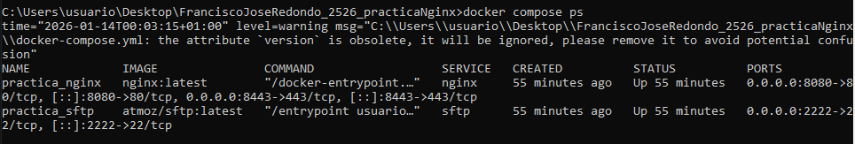
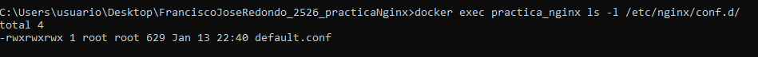
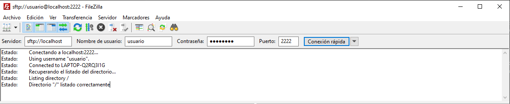
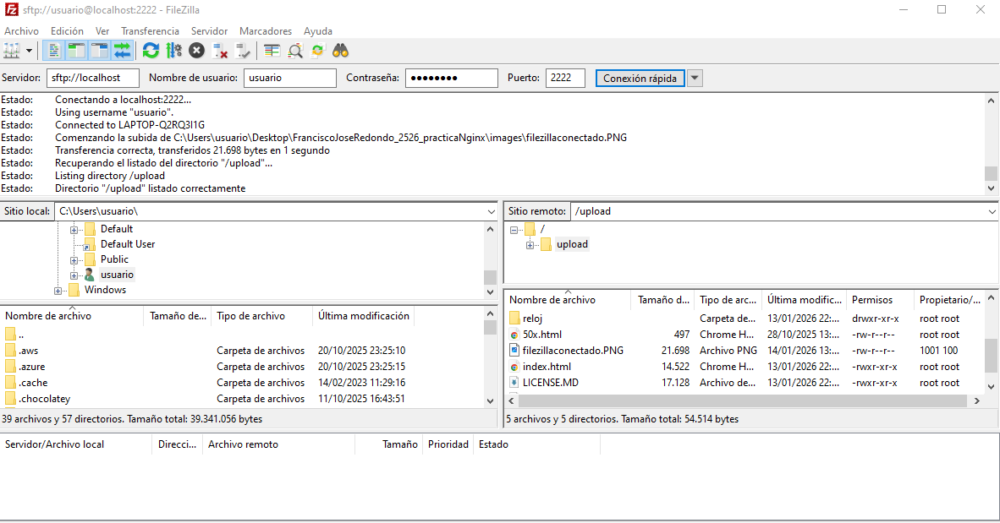
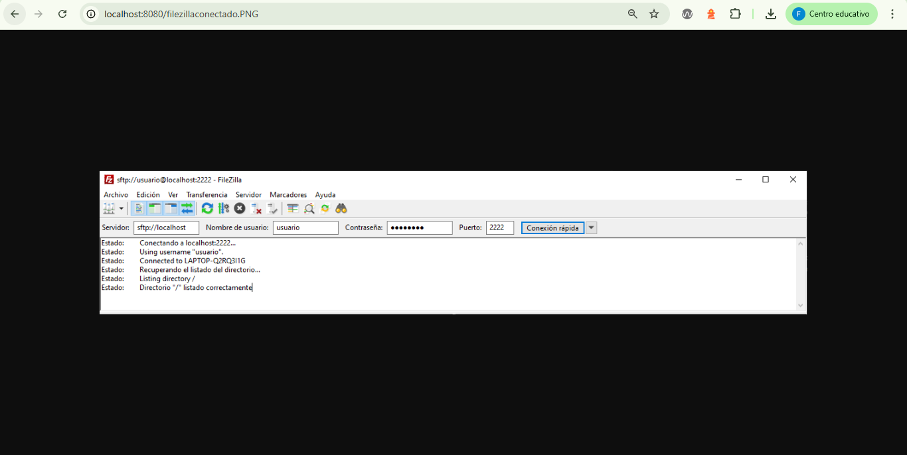
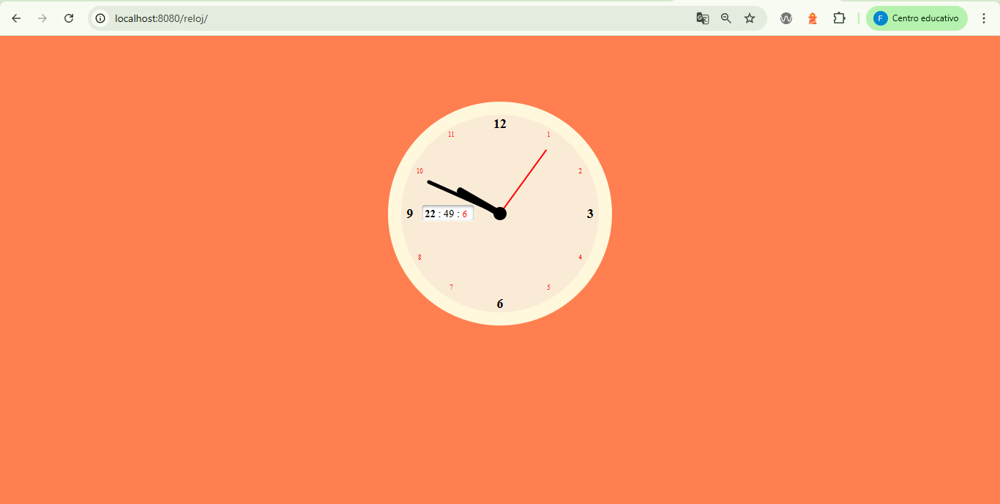
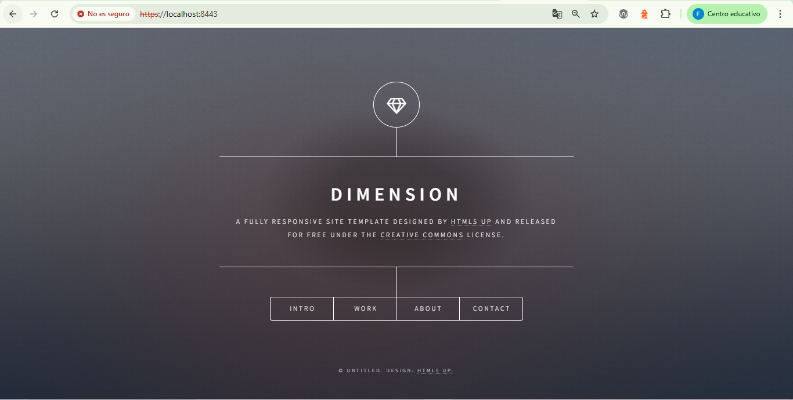
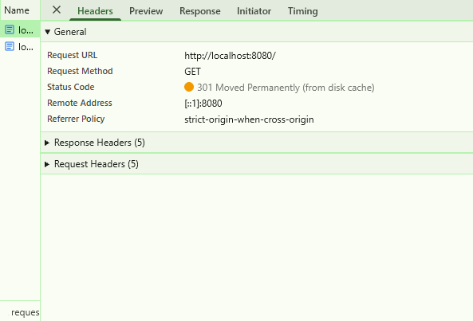
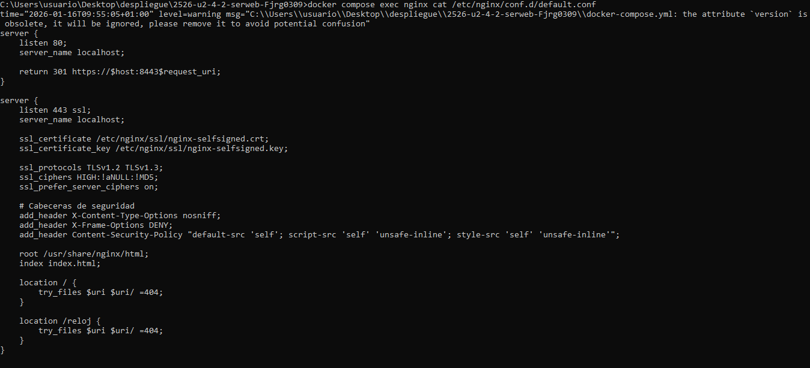
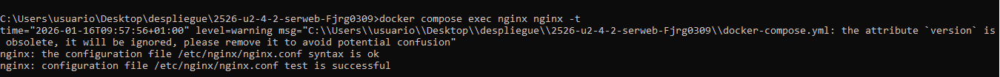

# DESPLIEGUE — Evidencias y respuestas

Este documento recopila todas las evidencias y respuestas de la practica.

---

## Parte 1 — Evidencias minimas

### Fase 1: Instalacion y configuracion

1) Servicio Nginx activo
- Que demuestra: El servicio Nginx está corriendo
- Comando: docker compose ps
- Evidencia: 

2) Configuracion cargada
- Que demuestra: El directorio está configurado
- Comando: docker exec practica_nginx ls -l /etc/nginx/conf.d/
- Evidencia: 

3) Resolucion de nombres
- Que demuestra: La web desplegada con un nombre propio
- Evidencia: 

4) Contenido Web
- Que demuestra: El diseño claro de la web
- Evidencia: 

### Fase 2: Transferencia SFTP (Filezilla)

5) Conexion SFTP exitosa
- Que demuestra: La conexión a SFTP de forma exitosa mediante Filezilla
- Evidencia: 

6) Permisos de escritura
- Que demuestra: Los archivos están presentes en el servidor remoto
- Evidencia: 

### Fase 3: Infraestructura Docker

7) Contenedores activos
- Que demuestra: Ambos servicios están corriendo
- Comando: docker compose ps
- Evidencia: 

8) Persistencia (Volumen compartido)
- Que demuestra: El archivo subido a SFTP es visible en la web
- Evidencia: 

9) Despliegue multi-sitio
- Que demuestra: La web reloj desplegada
- Evidencia: 

### Fase 4: Seguridad HTTPS

10) Cifrado SSL
- Que demuestra: La página web con el puerto 8443 configurado y con alerta de certificado autofirmado
- Evidencia: 

11) Redireccion forzada
- Que demuestra: Pestaña Network mostrando la respuesta al entrar por HTTP
- Evidencia: 

---

## Parte 2 — Evaluacion RA2 (a–j)

### a) Parametros de administracion
- Respuesta:

Análisis de directivas en /etc/nginx/nginx.conf:

1. worker_processes auto
- Qué controla: Número de procesos worker que manejará nginx. "auto" ajusta automáticamente según el número de núcleos de CPU disponibles.
- Configuración incorrecta: `worker_processes 1` en un servidor con múltiples núcleos limitaría el rendimiento a un solo proceso.
- Efecto: Subutilización de CPU y degradación de rendimiento bajo carga.
- Verificación: `docker compose exec nginx sh -c "grep worker_processes /etc/nginx/nginx.conf && nproc"`

2. worker_connections 1024
- Qué controla: Número máximo de conexiones simultáneas que puede manejar cada proceso worker.
- Configuración incorrecta: `worker_connections 10` limitaría severamente las conexiones concurrentes.
- Efecto: Error 503 "Service Temporarily Unavailable" cuando se exceda el límite.
- Verificación: `docker compose exec nginx sh -c "grep -A5 events /etc/nginx/nginx.conf"`

3. error_log /var/log/nginx/error.log notice
- Qué controla: Ubicación del archivo de log de errores y nivel de logging (notice, info, warn, error).
- Configuración incorrecta: `error_log off` deshabilitaría completamente el logging de errores.
- Efecto: Imposibilidad de diagnosticar problemas del servidor.
- Verificación: `docker compose exec nginx sh -c "ls -l /var/log/nginx/ && tail /var/log/nginx/error.log"`

4. access_log /var/log/nginx/access.log main
- Qué controla: Ubicación del archivo de log de acceso y formato utilizado ("main").
- Configuración incorrecta: `access_log off` deshabilitaría el registro de accesos.
- Efecto: Pérdida de información vital para análisis de tráfico y debugging.
- Verificación: `docker compose exec nginx sh -c "tail /var/log/nginx/access.log"`

5. keepalive_timeout 65
- Qué controla: Tiempo en segundos que el servidor mantiene viva una conexión HTTP persistente.
- Configuración incorrecta: `keepalive_timeout 300` mantendría conexiones abiertas 5 minutos.
- Efecto: Agotamiento de conexiones disponibles y mayor consumo de memoria.
- Verificación: `docker compose exec nginx sh -c "grep keepalive_timeout /etc/nginx/nginx.conf"`

6. include /etc/nginx/mime.types & include /etc/nginx/conf.d/*.conf
- Qué controla: Inclusión de archivos de configuración externos (tipos MIME y configuraciones de sitios).
- Configuración incorrecta: Ruta incorrecta como `include /nonexistent/*.conf`
- Efecto: Error de sintaxis y falla al iniciar nginx.
- Verificación: `docker compose exec nginx sh -c "nginx -t"`

7. #gzip on (comentado)
- Qué controla: Compresión gzip de respuestas HTTP para reducir ancho de banda.
- Configuración incorrecta: Activar gzip sin configurar tipos MIME apropiados.
- Efecto: Compresión innecesaria de archivos ya comprimidos o binarios.
- Verificación: `docker compose exec nginx sh -c "grep -n gzip /etc/nginx/nginx.conf"`

Cambio aplicado: keepalive_timeout 65 → 30

- Evidencias:
  - 
  - 
  - 

### b) Ampliacion de funcionalidad + modulo investigado
- Opcion elegida (B1 o B2): B2 - Cabeceras de seguridad
- Respuesta:

Implementación de cabeceras de seguridad en HTTPS:

He agregado estas cabeceras de seguridad al bloque server HTTPS en default.conf:

1. X-Content-Type-Options: nosniff
- Función: Impide que los navegadores interpreten el tipo MIME diferente al declarado por el servidor.
- Propósito: Previene ataques XSS basados en la interpretación incorrecta de tipos de archivo.
- Efecto: El navegador respeta estrictamente el Content-Type enviado por el servidor.

2. X-Frame-Options: DENY  
- Función: Controla si la página puede ser mostrada dentro de un frame, iframe u object.
- Propósito: Previene ataques de clickjacking al impedir que la página sea embebida en otros sitios.
- Efecto: Bloquea completamente el embedding de la página en cualquier marco.

3. Content-Security-Policy: "default-src 'self'; script-src 'self' 'unsafe-inline'; style-src 'self' 'unsafe-inline'"
- Función: Define las fuentes permitidas para cargar recursos (scripts, estilos, imágenes, etc.).
- Propósito: Mitiga ataques XSS controlando qué recursos pueden ejecutarse en la página.
- Configuración aplicada:
  - `default-src 'self'`: Solo permite recursos del mismo origen por defecto
  - `script-src 'self' 'unsafe-inline'`: Scripts del mismo origen + scripts inline
  - `style-src 'self' 'unsafe-inline'`: Estilos del mismo origen + estilos inline

Comandos de verificación:
- Validación: `docker compose exec nginx nginx -t`
- Recarga: `docker exec practica_nginx nginx -s reload`
- Prueba HTTPS: `curl.exe -I -k https://localhost:8443/`

- Evidencias (B2):
  - 
  - 
  - 

#### Modulo investigado: ngx_http_headers_more_module

Para qué sirve:
- Permite manipular cabeceras HTTP de forma más avanzada que el módulo `add_header` estándar.
- Capacidades principales:
  - Añadir, modificar o eliminar cabeceras de petición y respuesta en cualquier fase
  - Permite borrar cabeceras nativas de nginx como `Server`
  - Funciona con cabeceras de respuestas de error, cosa que `add_header` no hace por defecto
  - Mayor flexibilidad con directivas como `more_set_headers`, `more_clear_headers`, `more_set_input_headers`
- Uso común: Ocultar información del servidor, añadir cabeceras de seguridad avanzadas o personalizar respuestas de error

Cómo se instala/carga:

Compilación desde fuente

# 1. Descargar el módulo
git clone https://github.com/openresty/headers-more-nginx-module.git

# 2. Recompilar nginx con el módulo
./configure --add-module=/path/to/headers-more-nginx-module
make
make install

# Añadir cabeceras de seguridad incluso en páginas de error
more_set_headers 'X-Frame-Options: DENY';
more_set_headers 'X-Content-Type-Options: nosniff';

Fuentes consultadas:
- https://github.com/openresty/headers-more-nginx-module
- https://github.com/openresty/headers-more-nginx-module#readme
- https://www.nginx.com/resources/wiki/modules/headers_more/
- https://openresty-reference.readthedocs.io/en/latest/Directives/#headers-more

### c) Sitios virtuales / multi-sitio
- Respuesta:
El proyecto despliega dos sitios web bajo el mismo dominio diferenciados por ruta:
- Sitio principal: Accesible en `/` (https://localhost:8443/)
- Reloj: Accesible en `/reloj` (https://localhost:8443/reloj)

Diferencia entre multi-sitio por path vs por nombre (server_name):

El multi-sitio por path utiliza un único `server_name` y diferencia los sitios mediante directivas `location` basadas en la ruta URL. Ambos sitios comparten el mismo dominio, puerto y certificado SSL.

El multi-sitio por nombre utiliza múltiples bloques `server` con diferentes valores en la directiva `server_name` (www.sitio1.com` por ejemplo). Nginx selecciona el bloque server apropiado según el encabezado HTTP `Host` de la petición. Cada sitio puede tener configuraciones SSL, root y puertos completamente independientes.

Tipos adicionales de multi-sitio:

1. Multi-sitio por puerto: Diferentes sitios escuchan en puertos distintos, por ejemplo puerto 8080 para sitio1 y puerto 9090 para sitio2. Cada bloque `server` tiene `listen` con puertos diferentes.

2. Multi-sitio por ip: El servidor tiene múltiples IPs asignadas y cada sitio se vincula a una IP específica mediante `listen IP:puerto`, por ejemplo `listen 192.168.1.10:80` para sitio1 y `listen 192.168.1.11:80` para sitio2.

3. Multi-sitio por subdominio: Variante del multi-sitio por nombre donde se usan subdominios del mismo dominio base (ej: `blog.ejemplo.com`, `tienda.ejemplo.com`, `api.ejemplo.com`). Cada subdominio apunta a diferentes `root` o aplicaciones.

Configuración activa en /etc/nginx/conf.d/default.conf:

server {
    listen 443 ssl;
    server_name localhost;

    ssl_certificate /etc/nginx/ssl/nginx-selfsigned.crt;
    ssl_certificate_key /etc/nginx/ssl/nginx-selfsigned.key;

    Directiva ROOT: Define el directorio raíz donde nginx busca los archivos
    root /usr/share/nginx/html;
    index index.html;

    LOCATION /: Maneja las peticiones al sitio principal
    location / {
        # try_files: Intenta servir el archivo solicitado ($uri),
        # si no existe intenta como directorio ($uri/),
        # si tampoco existe devuelve error 404 (=404)
        try_files $uri $uri/ =404;
    }

    LOCATION /reloj: Maneja las peticiones al sitio secundario
    location /reloj {
        Hereda el root (/usr/share/nginx/html)
        Buscará archivos en /usr/share/nginx/html/reloj/
        try_files $uri $uri/ =404;
    }
}

Directivas clave explicadas:

- root /usr/share/nginx/html;: Establece el directorio base para todos los location. Para /reloj, nginx automáticamente buscará en /usr/share/nginx/html/reloj/.

- location /: Captura todas las peticiones que no coincidan con otros location más específicos. Sirve el contenido del sitio principal.

- location /reloj: Captura peticiones que comiencen con `/reloj`. Gracias al `root` heredado, nginx busca archivos en el subdirectorio `reloj/`.

- try_files $uri $uri/ =404;: Primero intenta servir el archivo exacto solicitado (`$uri`), si no existe intenta tratarlo como directorio y buscar el index (`$uri/`), si tampoco existe retorna error 404.

Cómo funciona /reloj:
Cuando un usuario accede a `https://localhost:8443/reloj`, nginx:
1. Captura la petición con `location /reloj`
2. Combina el `root` con el path: `/usr/share/nginx/html` + `/reloj`
3. Busca el archivo index.html en `/usr/share/nginx/html/reloj/index.html`
4. Sirve el contenido del reloj si existe, o retorna 404 si no

- Evidencias:
  - 
  - 
  - 

### d) Autenticacion y control de acceso
- Respuesta:
   - Directorio: `webdata/admin/`
   - Archivo: `webdata/admin/index.html` con contenido del panel de administración
   - Montado en el contenedor como: `/usr/share/nginx/html/admin/`

   - Usuario: `admin`
   - Contraseña: `Admin1234!`
   - Archivo: `.htpasswd` generado con htpasswd
   - Ubicación en contenedor: `/etc/nginx/.htpasswd`

  Configuración
   location /admin/ {
       auth_basic "Area Restringida - Administracion";
       auth_basic_user_file /etc/nginx/.htpasswd;
       try_files $uri $uri/ =404;
   }

Directivas de autenticación explicadas:

auth_basic "Area Restringida - Administracion";: 
  - Activa la autenticación HTTP básica para este location
  - El texto entre comillas es el "realm" o mensaje que ve el usuario al solicitar credenciales
  - Aparece en el diálogo de autenticación del navegador

auth_basic_user_file /etc/nginx/.htpasswd: 
  - Especifica la ruta al archivo que contiene las credenciales cifradas
  - El archivo contiene pares usuario:contraseña_cifrada
  - Nginx valida las credenciales contra este archivo

Pruebas
- Sin credenciales: `curl.exe -I -k https://localhost:8443/admin/`: 401 Unauthorized
- Con credenciales: `curl.exe -I -k -u admin:Admin1234! https://localhost:8443/admin/`: 200 OK

- Evidencias:
  - 
  - 
  - 
  - 

### e) Certificados digitales
- Respuesta:

¿Qué es .crt y .key?

- `.crt`: Archivo que contiene el certificado digital público. Incluye la clave pública, información del propietario (CN, organización) y la firma digital de la CA (o autofirmada). Se envía al cliente durante el handshake SSL/TLS.

- `.key`: Archivo que contiene la clave privada correspondiente al certificado. Debe mantenerse secreto y seguro. Se usa para descifrar datos cifrados con la clave pública y firmar el handshake SSL/TLS.

¿Por qué se usa `-nodes` en laboratorio?

La opción `-nodes` en OpenSSL genera la clave privada sin cifrado. En producción, las claves privadas deben estar cifradas con contraseña para mayor seguridad. En laboratorio se usa `-nodes` porque:
- Evita que nginx solicite la contraseña cada vez que inicia
- Facilita pruebas y reinicios automáticos
- Simplifica el despliegue en contenedores sin intervención manual

Ficheros generados:
- `nginx-selfsigned.crt`: Certificado autofirmado
- `nginx-selfsigned.key`: Clave privada RSA sin cifrar

Montaje en docker-compose.yml:
volumes:
  - ./nginx-selfsigned.crt:/etc/nginx/ssl/nginx-selfsigned.crt
  - ./nginx-selfsigned.key:/etc/nginx/ssl/nginx-selfsigned.key

Uso en default.conf:
server {
    listen 443 ssl;
    ssl_certificate /etc/nginx/ssl/nginx-selfsigned.crt;
    ssl_certificate_key /etc/nginx/ssl/nginx-selfsigned.key;
}

- Evidencias:
  - 
  - 
  - 

### f) Comunicaciones seguras
- Respuesta:

HTTPS operativo con redirección automática

El servidor nginx está configurado para asegurar todas las comunicaciones mediante HTTPS, redirigiendo automáticamente el tráfico HTTP inseguro.

Server block 1 - Puerto 80 (HTTP):
nginx
server {
    listen 80;
    server_name localhost;
    return 301 https://$host:8443$request_uri;
}

Server block 2 - Puerto 443 (HTTPS):
nginx
server {
    listen 443 ssl;
    server_name localhost;
    ssl_certificate /etc/nginx/ssl/nginx-selfsigned.crt;
    ssl_certificate_key /etc/nginx/ssl/nginx-selfsigned.key;
    ... configuración de sitios, locations, etc.
}

¿Por qué se usan dos server blocks separados?

- Porque Un bloque solo redirige, el otro sirve contenido, es más fácil de mantener.
- `return 301` es más rápido que evaluar condiciones con `if` dentro de un mismo bloque.
- Garantiza que todo el tráfico HTTP se redirige sin excepciones a HTTPS.

- Evidencias:
  - 
  - 

### g) Documentacion
- Respuesta:

Arquitectura del sistema:

Servicios:
- nginx: Servidor web con soporte SSL/TLS
- sftp: Servidor SFTP para transferencia de archivos

Puertos:
- `8080:80` - HTTP (redirige a HTTPS)
- `8443:443` - HTTPS (servidor principal)
- `2222:22` - SFTP

Volúmenes:
- `shared_data` - Volumen compartido entre nginx y sftp para contenido web
- `./default.conf` → `/etc/nginx/conf.d/default.conf`
- `./nginx-selfsigned.crt` y `.key` → `/etc/nginx/ssl/`
- `./webdata/admin` → `/usr/share/nginx/html/admin`
- `./.htpasswd` → `/etc/nginx/.htpasswd`

Configuración Nginx:

Ubicación: `/etc/nginx/conf.d/default.conf`

Server blocks:
- Bloque HTTP (puerto 80): Redirige todo el tráfico a HTTPS con código 301
- Bloque HTTPS (puerto 443): Sirve contenido con SSL/TLS

Directivas principales:
- `root /usr/share/nginx/html` - Directorio base
- `location /` - Sitio principal
- `location /reloj` - Sitio secundario (multi-sitio por path)
- `location /admin/` - Área protegida con autenticación básica

Seguridad:

- Certificados SSL: nginx-selfsigned.crt/key (autofirmados, 2048 bits)
- Protocolos: TLSv1.2 y TLSv1.3
- Redirección: HTTP → HTTPS automática (301 Moved Permanently)
- Cabeceras de seguridad (opción B2):
  - `X-Content-Type-Options: nosniff`
  - `X-Frame-Options: DENY`
  - `Content-Security-Policy: default-src 'self'; script-src 'self' 'unsafe-inline'; style-src 'self' 'unsafe-inline'`

Logs y análisis:

- Access log: `/var/log/nginx/access.log`
- Error log: `/var/log/nginx/error.log`
- Visualización: `docker compose logs -f nginx`
- Análisis: Métricas de acceso, errores, códigos de estado

Evidencias - Parte 1:
- [Servicio Nginx activo](evidencias/contenedores.PNG)
- [Configuración cargada](evidencias/directorioconfiguracion.PNG)
- [Resolución de nombres](evidencias/miweb.PNG)
- [Contenido Web](evidencias/miweb.PNG)
- [Conexión SFTP exitosa](evidencias/filezillaconectado.PNG)
- [Permisos de escritura](evidencias/subidaexitosa.PNG)
- [Contenedores activos](evidencias/contenedores.PNG)
- [Persistencia (Volumen compartido)](evidencias/archivovisible.PNG)
- [Despliegue multi-sitio](evidencias/reloj.PNG)
- [Cifrado SSL](evidencias/redireccion.PNG)
- [Redirección forzada](evidencias/301.PNG)

Evidencias - Parte 2:
- [a-01: Grep nginx.conf](evidencias/a-01-grep-nginxconf.png)
- [a-02: nginx -t](evidencias/a-02-nginx-t.png)
- [a-03: reload](evidencias/a-03-reload.png)
- [b2-01: Headers en default.conf](evidencias/b2-01-defaultconf-headers.PNG)
- [b2-02: nginx -t](evidencias/b2-02-nginx-t.PNG)
- [b2-03: curl HTTPS headers](evidencias/b2-03-curl-https-headers.PNG)
- [c-01: Sitio root](evidencias/c-01-root.png)
- [c-02: Sitio reloj](evidencias/c-02-reloj.png)
- [c-03: default.conf inside](evidencias/c-03-defaultconf-inside.png)
- [d-01: admin index.html](evidencias/d-01-admin-html.png)
- [d-02: default.conf auth](evidencias/d-02-defaultconf-auth.png)
- [d-03: curl 401](evidencias/d-03-curl-401.png)
- [d-04: curl 200](evidencias/d-04-curl-200.png)
- [e-01: ls certificados](evidencias/e-01-ls-certs.png)
- [e-02: compose certs](evidencias/e-02-compose-certs.png)
- [e-03: default.conf SSL](evidencias/e-03-defaultconf-ssl.png)
- [f-01: HTTPS navegación](evidencias/f-01-https.png)
- [f-02: 301 Network](evidencias/f-02-301-network.png)

### h) Ajustes para implantacion de apps
- Respuesta:
Despliegue de segunda app en /reloj:

Para desplegar una aplicación en `/reloj`, nginx combina la directiva `root` con el path del `location`:
- Los archivos deben estar en el subdirectorio `reloj/` del root
- Rutas en HTML/CSS/JS deben ser relativas (`./style.css`) o absolutas desde /reloj (`/reloj/style.css`)
- Si se usan rutas absolutas desde raíz (`/style.css`), nginx buscará en `/usr/share/nginx/html/style.css`, no en `/reloj/`

Problema típico con permisos al subir por SFTP:

Los archivos subidos por SFTP tienen permisos restrictivos o propietario incorrecto, nginx no puede leerlos y da error 403.

Solución: 
- Volumen compartido `shared_data` montado en ambos contenedores (nginx y sftp)
- Usuario SFTP configurado con UID 1001: `command: usuario:password:1001::upload`
- Permisos de escritura en el volumen compartido
- Archivos subidos son accesibles por nginx automáticamente

- Evidencias:
  - 
  - 

### i) Virtualizacion en despliegue
- Respuesta:

Diferencias entre instalación nativa y contenedor efímero:

Instalación nativa en SO:
- Nginx instalado directamente en el sistema operativo host
- Configuración en `/etc/nginx/` del host
- Persistencia: Todo permanece tras reinicios
- Dependencias: Requiere instalar paquetes en el SO
- Conflictos: Puede chocar con otros servicios en mismos puertos
- Actualizaciones: Dependen del gestor de paquetes del SO

Contenedor efímero + configuración por volúmenes:
- Nginx ejecuta en contenedor aislado, destruible y recreable
- Configuración y datos en volúmenes externos
- Contenedor efímero: `docker compose down` elimina el contenedor, pero mantiene volúmenes
- Dependencias: Autocontenidas en la imagen Docker
- Aislamiento: Puertos mapeados sin conflictos
- Actualizaciones: Cambiar versión de imagen y recrear contenedor
- Portabilidad: Mismo `docker-compose.yml` funciona en cualquier SO con Docker
- Configuración como código: `docker-compose.yml`, `default.conf` versionables

- Evidencias:
  - 

### j) Logs: monitorizacion y analisis
- Respuesta:

Monitorización en tiempo real:

`docker compose logs -f nginx`

- Evidencias:
  - 
  - 

## Checklist final

### Parte 1
- ✅ 1) Servicio Nginx activo - [Ver evidencia](evidencias/contenedores.PNG)
- ✅ 2) Configuracion cargada - [Ver evidencia](evidencias/directorioconfiguracion.PNG)
- ✅ 3) Resolucion de nombres - [Ver evidencia](evidencias/miweb.PNG)
- ✅ 4) Contenido Web - [Ver evidencia](evidencias/miweb.PNG)
- ✅ 5) Conexion SFTP exitosa - [Ver evidencia](evidencias/filezillaconectado.PNG)
- ✅ 6) Permisos de escritura - [Ver evidencia](evidencias/subidaexitosa.PNG)
- ✅ 7) Contenedores activos - [Ver evidencia](evidencias/contenedores.PNG)
- ✅ 8) Persistencia (Volumen compartido) - [Ver evidencia](evidencias/archivovisible.PNG)
- ✅ 9) Despliegue multi-sitio (/reloj) - [Ver evidencia](evidencias/reloj.PNG)
- ✅ 10) Cifrado SSL - [Ver evidencia](evidencias/redireccion.PNG)
- ✅ 11) Redireccion forzada (301) - [Ver evidencia](evidencias/301.PNG)

### Parte 2 (RA2)
- ✅ a) Parametros de administracion - [Ver evidencias](#a-parametros-de-administracion)
  - [a-01: Grep nginx.conf](evidencias/a-01-grep-nginxconf.png)
  - [a-02: nginx -t](evidencias/a-02-nginx-t.png)
  - [a-03: reload](evidencias/a-03-reload.png)
- ✅ b) Ampliacion de funcionalidad + modulo investigado - [Ver evidencias](#b-ampliacion-de-funcionalidad--modulo-investigado)
  - [b2-01: Headers en default.conf](evidencias/b2-01-defaultconf-headers.PNG)
  - [b2-02: nginx -t](evidencias/b2-02-nginx-t.PNG)
  - [b2-03: curl HTTPS headers](evidencias/b2-03-curl-https-headers.PNG)
- ✅ c) Sitios virtuales / multi-sitio - [Ver evidencias](#c-sitios-virtuales--multi-sitio)
  - [c-01: Sitio root](evidencias/c-01-root.png)
  - [c-02: Sitio reloj](evidencias/c-02-reloj.png)
  - [c-03: default.conf inside](evidencias/c-03-defaultconf-inside.png)
- ✅ d) Autenticacion y control de acceso - [Ver evidencias](#d-autenticacion-y-control-de-acceso)
  - [d-01: admin index.html](evidencias/d-01-admin-html.png)
  - [d-02: default.conf auth](evidencias/d-02-defaultconf-auth.png)
  - [d-03: curl 401](evidencias/d-03-curl-401.png)
  - [d-04: curl 200](evidencias/d-04-curl-200.png)
- ✅ e) Certificados digitales - [Ver evidencias](#e-certificados-digitales)
  - [e-01: ls certificados](evidencias/e-01-ls-certs.png)
  - [e-02: compose certs](evidencias/e-02-compose-certs.png)
  - [e-03: default.conf SSL](evidencias/e-03-defaultconf-ssl.png)
- ✅ f) Comunicaciones seguras - [Ver evidencias](#f-comunicaciones-seguras)
  - [f-01: HTTPS navegación](evidencias/f-01-https.png)
  - [f-02: 301 Network](evidencias/f-02-301-network.png)
- ✅ g) Documentacion - [Ver apartado completo](#g-documentacion)
- ✅ h) Ajustes para implantacion de apps - [Ver evidencias](#h-ajustes-para-implantacion-de-apps)
  - [h-01: Sitio root](evidencias/h-01-root.png)
  - [h-02: Sitio reloj](evidencias/h-02-reloj.png)
- ✅ i) Virtualizacion en despliegue - [Ver evidencias](#i-virtualizacion-en-despliegue)
  - [i-01: docker compose ps](evidencias/i-01-compose-ps.png)
- ✅ j) Logs: monitorizacion y analisis - [Ver evidencias](#j-logs-monitorizacion-y-analisis)
  - [j-01: logs follow](evidencias/j-01-logs-follow.png)
  - [j-02: métricas](evidencias/j-02-metricas.png)
